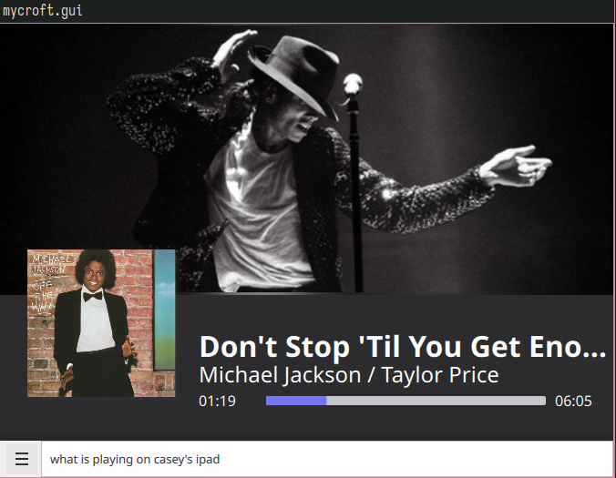

[](./LICENSE)
[](https://github.com/Ramblurr/mycroft-roon-skill/pulls)
[](https://mycroft.ai)

#  Roon Skill <sup><a href="#disclaimer">unofficial></a></sup> for Mycroft

Control your [Roon Core][roon] with your voice.

## About

> Roon is a platform for all the music in your home.

This skill interacts with your Roon Core and allows you to control music playback with your voice. It will play music from the library on your Roon Core, or from streaming services that you have connected to Roon (Such as Tidal or Qobuz).



Tested with Roon Core 2.0.


### Disclaimer

*This skill is not officially commissioned/supported by Roon or Mycroft AI. The trademark "ROON" is registered by "Roon Labs LLC". The trademark "Mycroft" is registered by "Mycroft AI Inc"*  This skill is purely a community endeavor.

## Examples

* "Configure Roon"
* "What is the status of Roon?"
* "Play James Brown's Funky Christmas in the kitchen"
* "Pause the living room"
* "Next song"
* "Shuffle the Christmas tag"
* "Play radio FM 4"
* "What is playing in the bathroom?"
* "Enable repeat mode in the office"
* "Turn off shuffle on my ipad"
* "Raise the volume in the bedroom to 30 percent"
* "Lower the volume to 30 percent in the bedroom"
* "Boost the volume in the kitchen"
* "Lower the volume on the terrace"
* "Mute everything"
* "Unmute the living room"


## Installation

Make sure to be within the Mycroft `virtualenv` before running the `msm` command.

```shell
source mycroft-core/venv-activate.sh
msm install https://github.com/Ramblurr/mycroft-roon-skill.git
```

## Setup

⚠️ Your Roon Core must be on the same network as your Mycroft device. If your Mycroft device and Roon Core are on different vlans, you will need to configure the host and port manually. ⚠️

### Discovery

After installing the Roon Skill you must connect it to your Roon Core. You can
do this by asking Mycroft to setup Roon:

1. "Hey Mycroft, Setup Roon"_ or "Hey Mycroft, Configure Roon"_

Then it will attempt to discover your Roon Core.

If automatic discovery works it will tell you to proceed with activation (see
below)

If it fails, it will tell you to configure the skill manually. You will need to vist https://home.mycroft.ai/#/skill,
navigate to the Roon Skill, and enter the IP Address/Host and Port for your Roon
Core.

### Activation

After Mycroft discovers your Roon Core automatically, or you manually configure
the skill, you need to authorize the Skill inside your Roon Remote.

1. Open your Roon Remote app
2. Browse to "Settings" in the menu
3. Browse to "Extensions" in the menu
4. You should see a section showing discovered Roon extensions, and find the Mycroft Skill there waiting for you.

Authorize the skill. Then ask Mycroft the status of Roon. "Hey Mycroft, What is
the status of Roon?" It should report that it is connected!

You're good to go, ask Mycroft to play you something!

"Hey mycroft play me something"


## Credits

Developed by [Casey Link](https://caseylink.com).

## Category

**Music & Audio**

## Tags

#Roon

## License

This skill is licensed under the GNU AGPL v3.0 or later.

```
roon-skill
Copyright (C) 2022 Casey Link

This program is free software: you can redistribute it and/or modify
it under the terms of the GNU Affero General Public License as published by
the Free Software Foundation, either version 3 of the License, or
any later version.

This program is distributed in the hope that it will be useful,
but WITHOUT ANY WARRANTY; without even the implied warranty of
MERCHANTABILITY or FITNESS FOR A PARTICULAR PURPOSE.  See the
GNU Affero General Public License for more details.

You should have received a copy of the GNU Affero General Public License
along with this program.  If not, see <http://www.gnu.org/licenses/>.
```


[roon]: https://roonlabs.com/
